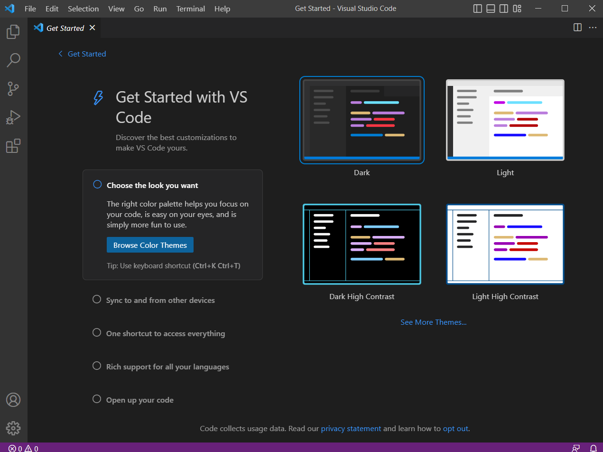
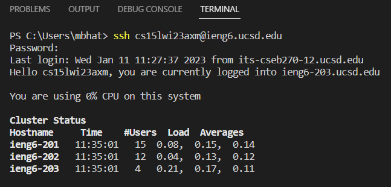
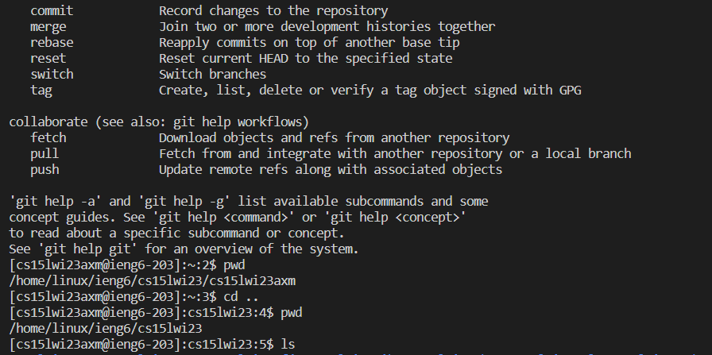

# CSE 15L Week 1 | Remote Access Blog Post
## Author: Manu Bhat - A17337644 - mbhat@ucsd.edu

### Step 1: Installing VSCode
VSCode is an integrated development environment (IDE) that provides many features related to programming. Of relevance today, it provides a shell (terminal) that can connect to a remote server. 

Install VSCode from the following link, and follow the specified instructions (which shuld be self explanatory): [VSCode website](https://code.visualstudio.com/)

Once you open VSCode, it should look something like this.



### Step 2: Remotely Connecting

First, find your UCSD CSE15L account using this handy reference manual: [How to Reset your Password](https://docs.google.com/document/d/1hs7CyQeh-MdUfM9uv99i8tqfneos6Y8bDU0uhn1wqho/edit)
Essentially, the idea is to link an account or handle that we can use to verify we are authorized to access the remote server, and not some random attacker.

Now that we have all the tools necessary for remote access, we can actually establish the connection. In the VSCode terminal (Control + backtick), type ```ssh [ACCOUNT NAME]@ieng6.ucsd.edu``` If a security warning is present, say yes. From here, type in your new password (make sure it's been reset properly!). If succesful, your screen should look like this (essentially just a server log and some benchmarks).



### Step 3: Trying some commands
Commands are the way we interact with the remote server. By using ssh, we already established a remote connection. Now with that connection, we can query, inspect, or modify the state of the server. Here are a few examples and possible output. NOTE: by using ssh, we essentially exit the client scope and all commands are executed on the server. To start writing commands to modify your local system, type ```exit``` Always remember that everything you're doing inside the ssh tunnel affects the cloud, and sometimes will not be undoable!

- ```ls``` lists files in current directory
- ```mkdir [name]``` creates a folder caled name in the current directory
- ```cd [directory]``` changes the working directory
- ```cp [src] [dst]``` copies the source file into the dst path
- ```cat [files...]``` concatenates the file contents of the paths provided, and emits it into standard output

Of course, there are many more commands available. Here is an example of what you might have seen.


