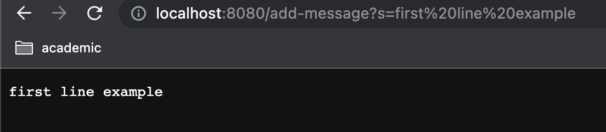
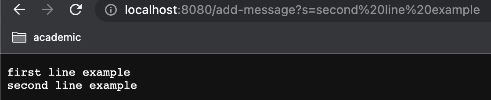
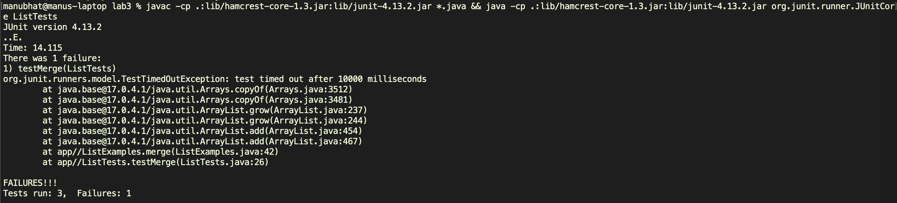

# CSE 15L Lab 3 Report| Web Serves and Debugging 
## Author: Manu Bhat - A17337644 - mbhat@ucsd.edu

### Part 1 String Server

Initally our state consists of the empty string, which represents our running content.
When we access `localhost:8080/add-message?s=first%20line%20example` the webserver proxy will receive the message and eventually it wil be relayed to our `StringHandler` class. Specifically, the `handleRequest` method will be called with the specific URI.  
From here, we first make sure that the request is in the format that we want, and only then continue. Once we verify it's in the proper form, we append the input string and a newline to our state. In this case the state is now `"first line example\n"` We return this back to the user 

Between API calls, the state is persistent so the state string is still `"first line example\n"`
The same routing goes on as happened with the first line, and we also perform the same checks to ensure the input is sanitized to the correct format. 
When we access `localhost:8080/add-message?s=second%20line%20example` we now append the second line to our running state. The entire state is now `"first line example\nsecondline example\n"` We return this string to the user. Note that while the state does not change, the local variables and parameters to the handle request method do change, and are updated to reflect the new request (as opposed to having a URI point to the old call), which makes sense. 

Here is the code for my class (the URLHandler was unmodified from the starter code)
```
import java.io.IOException;
import java.net.URI;
import java.util.*;

class StringHandler implements URLHandler {
    private String running = ""; 

    public String handleRequest(URI url) {
        if (url.getPath().equals("/add-message") && url.getQuery() != null) {
            String[] parameters = url.getQuery().split("=");
            if (parameters != null && parameters.length >= 2 && parameters[0].equals("s")) {   
                running += parameters[1] + '\n'; 
                return running;
            }
        } 
        return "404 Not Found or malformed input query!";
    }
}

class StringServer {
    public static void main(String[] args) throws IOException {
        if(args.length == 0){
            System.out.println("Missing port number! Try any number between 1024 to 49151");
            return;
        }

        int port = Integer.parseInt(args[0]);

        Server.start(port, new StringHandler());
    }
}
```

### Part 2 Buggy List Merge

For the merge method provided, a **failure inducing input** is any where the second list contains the maximum value, and will lead us to an infinite loop. Here is simple code that demonstrates this. The timeout feature is used so we can catch the infinite loop.
```
@Test(timeout = 10000)
public void testMerge() {
    ArrayList<String> x = new ArrayList<>();
    ArrayList<String> y = new ArrayList<>();
    y.add("Good1");
    assertEquals(y, ListExamples.merge(x,y));
}
```

On the contrary, an input that does not cause a failure would be one where the first list contains the maximum, so we can just swap the two list.s
```
@Test(timeout = 10000)
public void testMerge() {
    ArrayList<String> x = new ArrayList<>();
    x.add("Good1");
    ArrayList<String> y = new ArrayList<>();
    assertEquals(x, ListExamples.merge(x,y));
}
```

Here is the JUnit testing of the above two methods (in addition to one more). Notice that there is only one error, as the second one passed succesfully.

Merge Code (Original/Buggy)
```
static List<String> merge(List<String> list1, List<String> list2) {
    List<String> result = new ArrayList<>();
    int index1 = 0, index2 = 0;
    while(index1 < list1.size() && index2 < list2.size()) {
        if(list1.get(index1).compareTo(list2.get(index2)) < 0) {
            result.add(list1.get(index1));
            index1 += 1;
        }
        else {
            result.add(list2.get(index2));
            index2 += 1;
        }
    }
    while(index1 < list1.size()) {
        result.add(list1.get(index1));
        index1 += 1;
    }
    while(index2 < list2.size()) {
        result.add(list2.get(index2));
        index1 += 1;
    }

    return result;
  }
```

Merge Code (Fixed by changing the index1 += 1 to index2 += 1. With this, there is no longer an infinite loop as the appropriate index variable is updated)
```
static List<String> merge(List<String> list1, List<String> list2) {
    List<String> result = new ArrayList<>();
    int index1 = 0, index2 = 0;
    while(index1 < list1.size() && index2 < list2.size()) {
        if(list1.get(index1).compareTo(list2.get(index2)) < 0) {
            result.add(list1.get(index1));
            index1 += 1;
        }
        else {
            result.add(list2.get(index2));
            index2 += 1;
        }
    }
    while(index1 < list1.size()) {
        result.add(list1.get(index1));
        index1 += 1;
    }
    while(index2 < list2.size()) {
        result.add(list2.get(index2));
        index2 += 1;
    }
    return result;
  }
```

### Part 3 Reflection

There were a couple of things I learned from Lab 2 and 3.

From Lab 2 I learned:
- How to use Java to set up a web server. I've worked with flask to make python web servers before, but it's pretty cool that you can do so in Java without any third party libraries
- I learned how to deploy my custom web server on the UCSD computers

From Lab 3 I got practice with:
- How to use the timeout feature in JUnit to detect infinite loops, as well as using the assertThrows for fine grained control
- Vocabulary related to finding bugs, which is important in communiticating my ideas to other programmers
- Detecting minute bugs and coming up with test cases that expose those scenarios

Overall, they're both very important skills pertinent to my abilities in computer science.

### Step 1: Installing VSCode
VSCode is an integrated development environment (IDE) that provides many features related to programming. Of relevance today, it provides a shell (terminal) that can connect to a remote server. 

Install VSCode from the following link, and follow the specified instructions (which should be self explanatory): [VSCode website](https://code.visualstudio.com/)

Once you open VSCode, it should look something like this.


### Step 2: Remotely Connecting

First, find your UCSD CSE15L account using this handy reference manual: [How to Reset your Password](https://docs.google.com/document/d/1hs7CyQeh-MdUfM9uv99i8tqfneos6Y8bDU0uhn1wqho/edit)
Essentially, the idea is to link an account or handle that we can use to verify we are authorized to access the remote server, and not some random attacker.

Now that we have all the tools necessary for remote access, we can actually establish the connection. In the VSCode terminal (Control + backtick), type ```ssh [ACCOUNT NAME]@ieng6.ucsd.edu``` If a security warning is present, say yes. From here, type in your new password (make sure it's been reset properly!). If succesful, your screen should look like this (essentially just a server log and some benchmarks).


### Step 3: Trying some commands
Commands are the way we interact with the remote server. By using ssh, we already established a remote connection. Now with that connection, we can query, inspect, or modify the state of the server. Here are a few examples and possible output. NOTE: by using ssh, we essentially exit the client scope and all commands are executed on the server. To start writing commands to modify your local system, type ```exit``` Always remember that everything you're doing inside the ssh tunnel affects the cloud, and sometimes will not be undoable!

- ```ls``` lists files in current directory
- ```mkdir [name]``` creates a folder caled name in the current directory
- ```cd [directory]``` changes the working directory
- ```cp [src] [dst]``` copies the source file into the dst path
- ```cat [files...]``` concatenates the file contents of the paths provided, and emits it into standard output

Of course, there are many more commands available. Here is an example of what you might have seen.


