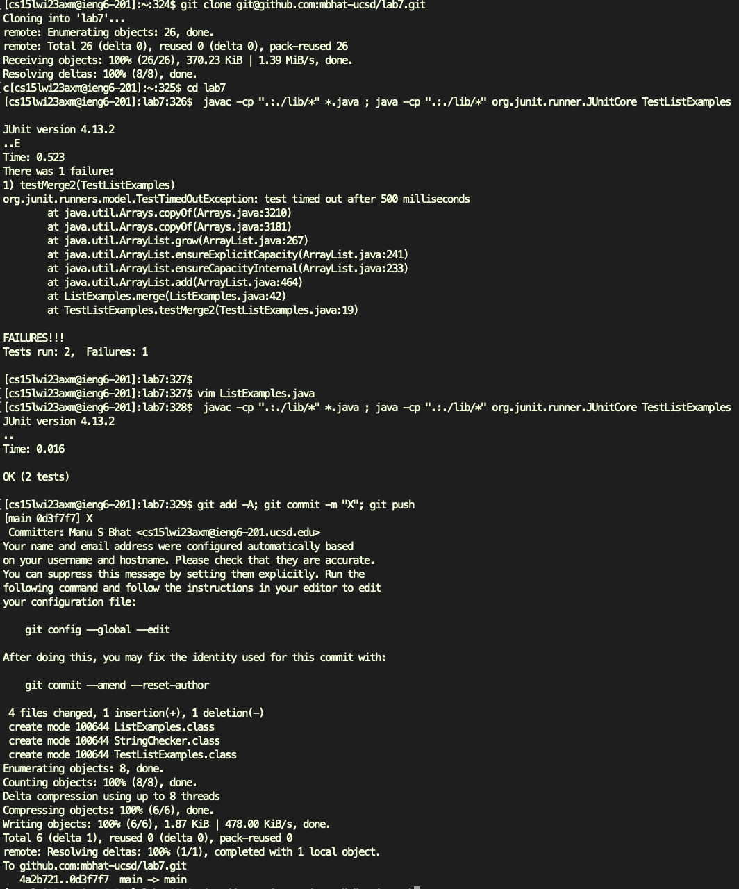
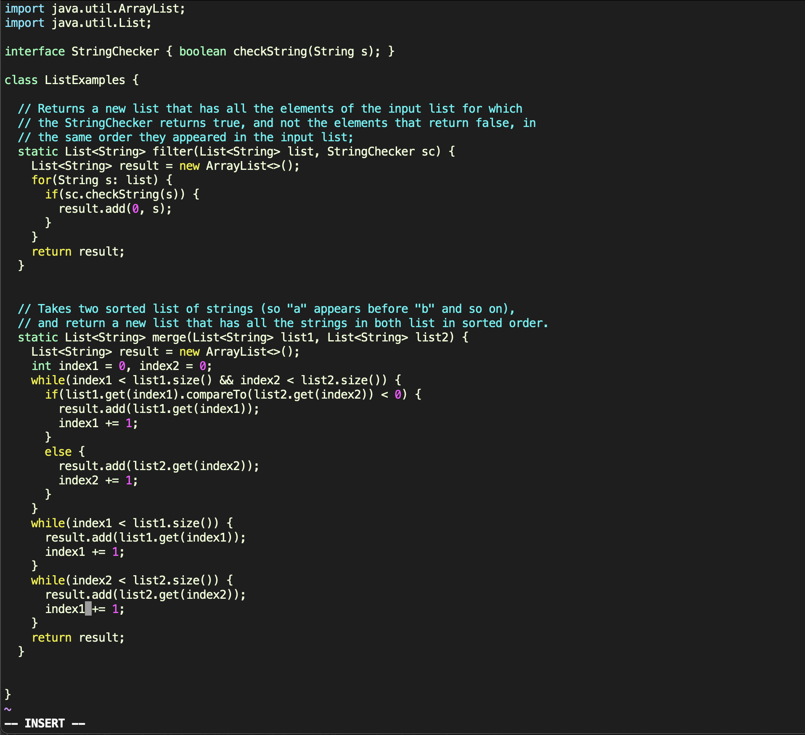

# CSE 15L Lab Report 4 | CSE Labs Done Quick 
## Author: Manu Bhat - A17337644 - mbhat@ucsd.edu

### CSE Labs Done Quick

I will be summarizing the steps I took to solve the competition questions. I will be sharing my straightforward solution and the "cheese" solution I had.

# Main Solution
1. Log into ieng6 by running `ssh cs15lwi23axm@ieng6.ucsd.edu <enter>`. I just had this in my history as the last command on my local computer, so it was just `<up>`.
2. I had the github URL saved in my copy paste buffer, so I typed `git clone <command+v> <enter>` to clone the repository. For example, my clipboard would be `git@github.com:mbhat-ucsd/lab7.git`
3. To run the tests, I first `cd la <tab> <enter>` which expands to `cd lab7 <enter>`. Then I used the command `javac -cp ".:./lib/*" *.java ; java -cp ".:./lib/*" org.junit.runner.JUnitCore TestListExamples <enter>`. To make this a bit more efficient (as it's pretty long), I copy pasted the classpath part from the first command to the second command. Everything else I have I typed out fully.
4. To actually make the edit, I just type `vim ListE <tab> <enter>` which expands to `vim ListExamples.java <enter>`. I then went to line 43 using ':43' and then changed `index1` to `index2` using REPLACE mode on vim.
5. To run the tests again, I just pressed the up arrow twice `<up_arrow> <up_arrow>`
6. To do the git commands, I typed this out by hand `git add -A; git commit -m "X"; git push <enter>`

Done! My personal best using this method was 52 seconds. Other tips I did to speed things up were type commands as previous ones were loading, which was helpful.

Here are a few screenshots of the entire process one I log in. I show the main terminal screen, as well as the vim screen.




# Cheese solution
1. I just copy pasted this command into the terminal (after doing `ssh cs15lwi23axm@ieng6.ucsd.edu ` ), this was how I won the competition :).

    ```
    git clone git@github.com:mbhat-ucsd/lab7.git ; 
        cd lab7 ; javac -cp ".:./lib/*" *.java ; 
        java -cp ".:./lib/*" org.junit.runner.JUnitCore TestListExamples ; 
        vim ListExamples.java ; 
        javac -cp ".:./lib/*" *.java ; 
        java -cp ".:./lib/*" org.junit.runner.JUnitCore TestListExamples ; 
        git add -A ; 
        git commit -m "X" ; 
        git push
    ```

2. To actually edit the file, I had the vim open at the previous time I opened the file, which was in the perfect place for me to edit (the actual vim command is also in my one liner). I got a score of 15 seconds.
